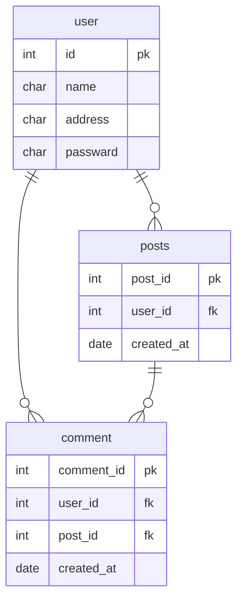

##  掲示板サイト

このサイトは**バスケ**についての議題を掲示板に書き込み会話していくサイトです

## ER図

## API仕様書

**概要**

・記事に対してして行ったコメントの数を返す

GET /api/posts/{post_id}/comments/count

**ステータスコード**

200,404の2種類を使用している

**レスポンス**

・成功時
{
    post_id:123
    comment_count:3
}

・失敗時
{
    error:Post not found
}
